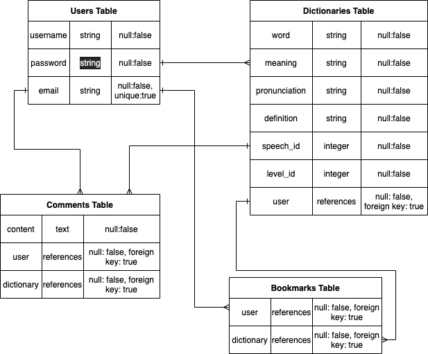

# Memorizers

## アプリケーションの概要
 暗記したい英単語を画像としてフラッシューカード化し、他のユーザーと共有したり、メモを残せたり、自分独自のフラッシューカードにカスタマイズできるインプット、アウトプット双方できる暗記専用のアプリケーションです。
 
 このアプリケーションを利用することの目的は下記の 3 つに集約されます
 - 英単語を画像と紐づける事によって、記憶の定着を図る
 - メモ機能で特定の単語に情報を追加し、他のユーザーと情報を共有。
 - 単語をフラッシュカード化し、クイズのように楽しむ。
 
 ### **「英単語を画像と紐づける事によって、記憶の定着を図る」**
 従来の英単語帳には画像などはなく、文字列として暗記する以外の方法がなく、暗記する際効率がとても悪かったので、この機能をつけました。
 しかし、単語から想起される映像は個々によって異なるため、ユーザー自身が自由に画像を選択できるようにし、暗記の手助けになるよう工夫しました。
 
 ### **「メモ機能で特定の単語に情報を追加し、他のユーザーと情報を共有」**
 従来の単語帳では、書き込むと段々と複雑化したり、書き込むスペースが無くなったりと、情報の管理が難しいためメモ機能を追加しました。書き込む行為事態がアウトプットとして重要であるのと、メモなどを利用し、他のユーザーの視点でその単語に触れることで記憶の定着に役立てることができます。
 
 ### **「単語をフラッシュカード化し、クイズのように楽しむ」**
 ブックマーク機能で好きな単語をフラッシュカードに加え、特定の単語だけを学習できるようにしました。単語を覚える際、文字列の箇条書きだと飽きてしまい、学習効率が落ちてしまうのでフラッシュカードを再現して制作しました。
 
 
 # 使用言語・技術
 - Ruby
 - Ruby on Rails
 - JavaScript
 - HTML/CSS
 - SQL
 - 
 # Demo
 ## Top画面
 ### 
 フラッシュカード機能
 ### 
 
 ## ユーザー新規登録ページ
|  ログイン画面  |  新規登録画面  |
| ------------| ------------ |
|   |  |

## 単語登録ページ
|  上 | 下　|
| ------------| ------------ |
|    | |

## マイページ

## ブックマークリスト

## 単語詳細ページ
|  単語詳細 |  メモ機能|
| ------------| ------------ |
|    ||

## マイフラッシュカードページ
　
## デプロイ後のURL
  https://memorizers-123456.herokuapp.com/
## テスト用アカウント
   - アカウント名： TEST
   - email: test123456@example.com
   - password: test1234
 
 
## 利用方法
　1. アクセスするとトップページからヘッダーの新規登録ボタンから新規登録をする。
　2. ログイン完了後、トップページに遷移し、他のユーザーが制作したフラッシュカードを閲覧できる。
　3. ヘッダーにあるcreateボタンから単語新規登録し、登録後、トップページに出力する。
　4. ヘッダーにある自分の登録名をクリックすることで、自分が作成した単語が出力され、編集画面に遷移できる。
　5. 自分のマイページでは制作した単語をブックマークしたり、他のユーザーが自分の制作した単語をブックマークしている場合はブックマークのカウント数が表示される。
　6. 他のユーザーのフラッシューカードをクリックすると単語詳細ページに遷移し、そこでブックマークしたり、メモなどを残すことができる。
　7. 追加された単語は、ヘッダー右のbookmarksボタンを押すことで、現在自分がブックマークしている単語を表形式で閲覧できる。
　8. ヘッダー右にあるflashcardボタンをクリックすることで、ブックマークした単語をフラッシュカード形式で出力される。
　9. ブックマークから外したい場合は、単語詳細画面からブックマークアイコンを押すことで、ブックマークを外したり、追加したりすることができる。

## 目指した課題解決
　このアプリは学生社会人を含め、幅広い年齢層が対象です、自分自身、暗記が苦手なため効率を少しでもあげれればと思い制作しました。
 
 
## 洗い出した要件
- 英単語一つ一つに画像つけたい
- 登録した単語をフラッシュカードとして出力したい。
- 自分が作った単語を他のユーザーと共有したい
- アウトプットとしてメモ機能を追加したい
# テーブル設計

## users テーブル

| Column             | Type   | Options     |
| ------------------ | ------ | ----------- |
| username           | string | null: false |
| email              | string | null: false |
| encrypted_password | string | null: false |

  ## Association
  - has_many :dictionaries, dependent: :destroy
  - has_many :bookmarks, dependent: :destroy
  - has_many :bookmark_dictionaries, through: :bookmarks, source: :dictionary
  - has_many :comments, dependent: :destroy

## dictionaries テーブル
| Column             | Type       | Options                        |
| ------------------ | ---------- | ------------------------------ |
| word               | string     | null: false                    |
| meaning            | string     | null: false                    |
| pronunciation      | string     | null: false                    |
| speech_id          | integer    | null: false                    |
| level_id           | integer    | null: false                    |
| user_id            | references | null: false, foreign_key: true |
| definition         | text       | null: false,                   |

   ## Association
  - belongs_to :user
  - belongs_to_active_hash :speech
  - belongs_to_active_hash :level
  - has_one_attached :image
  - has_many :bookmarks, dependent: :destroy
  - has_many :comments, dependent: :destroy

## comments テーブル
| Column             | Type       | Options                       |
| ------------------ | ---------- | ----------------------------- |
| user_id            | references | null: false, foreign_key: true|
| dictionary_id      | references | null: false, foreign_key: true|
| content            | text       | null: false                   |

 ## Association
 - belongs_to :user
 - belongs_to :dictionaries

## bookmark テーブル
| Column             | Type       | Options                       |
| ------------------ | ---------- | ----------------------------- |
| user_id            | references | null: false, foreign_key: true|
| dictionary_id      | references | null: false, foreign_key: true|

 ## Association
 - belongs_to :user
 - belongs_to :dictionaries

